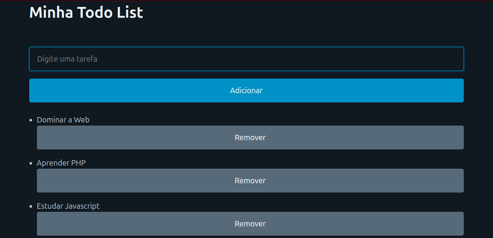

# Todo List em TypeScript

Projeto simples de ToDo List feito com:

- HTML
- Pico.css
- Javascript
- Atualizado para TypeScript

---

## 📦 Como usar

1️⃣ Instalar dependências

Após clonar o projeto, execute:

`npm install`

2️⃣ Compilar o TypeScript
Para compilar o projeto:

`npx tsc`

Para compilar automaticamente sempre que salvar:

`npx tsc --watch`

3️⃣ Executar no navegador

Basta abrir o arquivo index.html no navegador ou em um servidor.

Atenção: o arquivo JavaScript gerado estará na pasta dist/.

Certifique-se de que o ``

